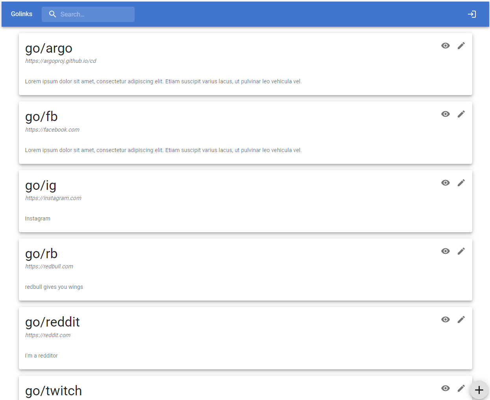

# Golinks Frontend

For frontend of [https://github.com/gambitran/fastapi-golinks](https://github.com/gambitran/fastapi-golinks)

Built using Vite/React/TS

## Development

Run `yarn dev`

## TODO

- Implement authz
